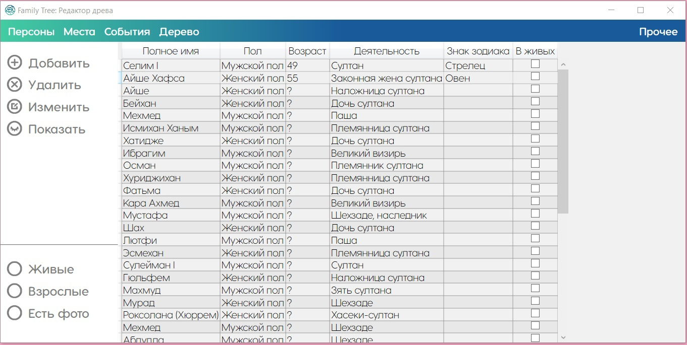

<!-- PROJECT LOGO -->
 

  

  <h3 align="center">Family Tree</h3>
  
Июль 2023

  

     Приложение для создания генеалогических деревьев
     
    <a href="https://krabochki.github.io/Resume/family-tree.html">Подробнее</a>
    ·
    <a href="https://github.com/krabochki/FamilyTree/issues">Баги</a>
    ·
    <a href="https://www.linkedin.com/in/polina-kuzmenok-550449291">LinkedIn автора</a>
  

<!-- TABLE OF CONTENTS -->

  
Содержание

  <ol>
    <li><a href="#warning">Внимание</a></li>
    <li><a href="#about">О проекте</a></li>
    <li><a href="#stack">Технологии</a></li>
      <li><a href="#setup">Установка</a></li>
    <li><a href="#author">Автор</a></li>
  </ol>

<!-- ABOUT THE PROJECT -->

## ВНИМАНИЕ ⚠

В связи с выбором базы данных для проекта (Microsoft Access .accdb) приложение с большой вероятностью НЕ запустится корректно на компьютерах, на которых не установлен пакет Office (Excel, Word, PowerPoint, Access). Если приложение сразу дает возможность создать и открыть древо, значит, все нормально. Если на попытке создать новое древо возникает ошибка, вам может помочь установка Microsoft Access Database Engine. Его можно скачать с официального сайта Microsoft, весит он немного (25 МБ). Выбрать для загрузки нужно именно первый вариант без приписки Х64. Это позволит пользоваться функционалом баз данных Access без необходимости установки полного пакета Office, что, собственно, и нужно для корректной работы приложения. 

<a href="https://www.microsoft.com/en-us/download/details.aspx?id=13255 "/> >>> Официальный Microsoft Access Database Engine <<< </a>

## О проекте 📢

Проект "Family Tree" обеспечивает удобный и интуитивно понятный интерфейс, который позволит пользователям легко создавать, редактировать и визуализировать свои генеалогические древа. 
Приложение обеспечивает удобное и наглядное представление генеалогической информации, позволяя пользователям оживить свою генеалогическую историю и просматривать в электронном виде свои родственные связи.

 

    

(<a href="#readme-top">наверх</a>)

## Технологии ⚙️

- язык программирования: C#;
- среда разработки: Microsoft Visual Studio;
- фреймворк: Windows Presentation Foundation (WPF);
- библиотеки: GiGraph (на основе Graphviz).

(<a href="#readme-top">наверх</a>)

## Установка 💿 

- скачайте файл Install Family Tree.exe в корне проекта;
- следуйте инструкциям установщика;
- проект будет установлен в выбранное вами место на компьютере.

(<a href="#readme-top">наверх</a>)

 

<h3 align="center"> Автор 💡</h3>

  

Автор проекта: Кузьменок Полина :)
     
      <a href="https://instagram.com/krabochki">@Instagram</a>
    ·
    <a href="https://www.linkedin.com/in/polina-kuzmenok-550449291">@LinkedIn</a>
    ·
    <a href="https://t.me/krabochki">@Telegram</a>   
    ·
    <a href="https://vk.com/nanananana_come_on">@Telegram</a>
  

(<a href="#readme-top">наверх</a>)

